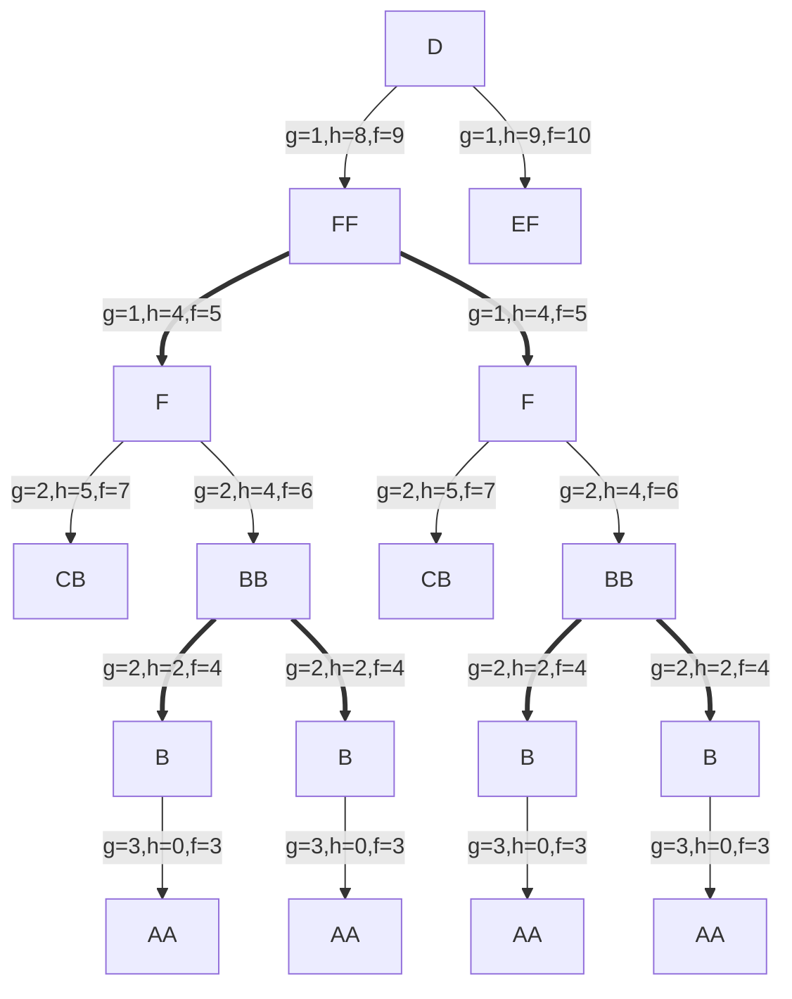
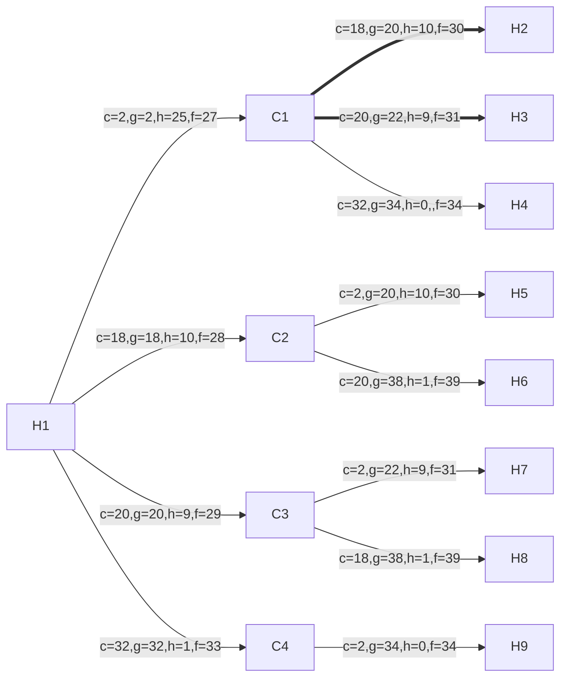
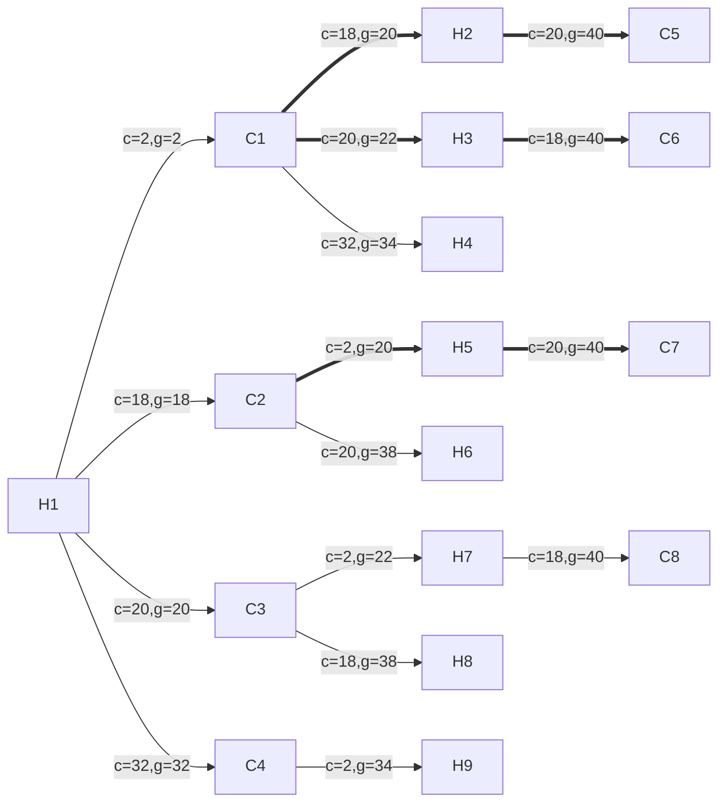

# MMN 16 - Prolog

## Question 1

### Transitions

$$
\begin{array}{l}
A \rarr EF \mid FF \\
E \rarr FC \mid BB \\
F \rarr CB \mid BB \\
C \rarr BA \\
B \rarr AA
\end{array}
$$

### Start

$D​$

### Goal

$ A^*$ (where the asterisk denotes the Kleene star)

### Costs

All transitions have an equal cost of 1

### Heuristic Function Definition

$$
h(Y_1 Y_2) = h(Y_1) + h(Y_2) 
$$

where the base evaluations are
$$
\begin{array}{l}
h(D) = 6 \\
h(E) = 5 \\
h(F) = 4 \\
h(C) = 3 \\
h(B) = 2 \\
h(A) = 0
\end{array}
$$

### Evaluation Function Definition

The evaluation function is defined as $f(n) = g(n) + h(n)$ where $g(n)$ is the cumulative path weight and $h(n)$ is the heuristic estimate. 

### Search Algorithm

We'll define our best-first search algorithm as the _A*_ algorithm, and $f(n)$ as its evaluation function. 

### Graph Definition

We'll define a directed graph such that each node stands for symbol string and each edge a transition (thick edge: AND, thin edge: OR).

### Search Tree Illustration

The algorithm will explore the node having the lowest estimate at each iteration, yielding the below search tree. 

## Question 2

### Game Description

The deck has some number of cards. Each card has an integer value from the range [1,39] (with replacement). 

The game is played by 2 players. Each player starts with no cards.

Each player draws a card in turn. The aggregate sum of a player hand can't exceed 40. Players _must_ draw cards until no more cards can be drawn without exceeding the limit on deck cumulative value. 

The game ends when _both_ players can't draw any more cards. 

### State Definition

A state is a tuple encoding the list of available cards, the sum of cards held by each player, and the turn indicator `(set_of_cards, turn_indicator, h_player_sum, c_player_sum)`. 

### Start State

The game starts with both players having no cards on hand. We'll define the starting turn to be of  `h_player`. 

### Transition

At each transitionone card is removed from the deck and its value added to the current players total such that the limit is not exceeded, otherwise no card is drawn. In addition, the turn sign bit flips. 

### Terminal State

Both players can't draw another card. 

### Goal

Cumulative hand value doesn't exceed limit and its distance from it is minimal. 

### Heuristic Function

Average value between worst and best card. The rationale for this choice is the opponent won't allow the player to make the best choice, but since the player still has _some_ choice, they won't be left with the worst card either. 

### Evaluation Function

Total value of hand + heuristic evaluation.

### Q2.1

We're given a deck of cards having the value `[2,18,20,32]`. Running the Alpha-Beta algorithm 2 turns deep will yield the following search tree (bold edges are pruned):

### Q2.2

### Q2.3

Searching down to the leaves allows the player to win every time. The heuristic function yield a losing move. We hypothesize the existence of a non-hedging heuristic better suited to a zero-sum game (e.g assume taking the 2nd best choice). 

